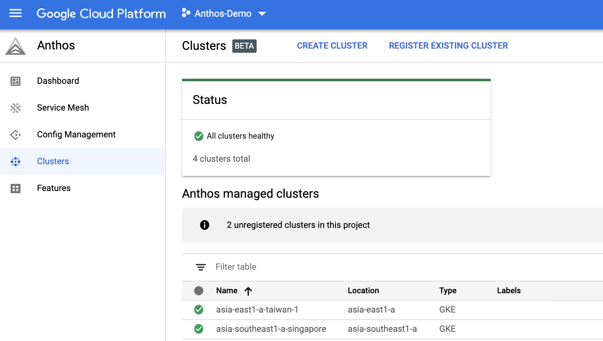

## Anthos GKE Demo
This project is to demonstrate Anthos GKE Capabilities. The entire lab includes the following tasks:
* Produce GKE
* Register to Anthos
* Install Anthos Configuration Manager (ACM)
* Install Anthos Service Mesh (ASM)
* Configure Cloud Build
* Configure Cloud Run

There are pre-requisites in each task to properly use this lab. This README is organized in the following struct. In each task, 3 sections will be briefed, including pre-requisite, lab-steps, and demos. Please keep in mind this is a self-maintained lab. If you encountered any issue, please file a ticket. 

---
### Produce GKE and VPC
This task is to create a GKE and VPC accordingly. In the sample file, I use default VPC but you could change it.
#### Pre-requisite
* Please make sure you have sufficient privilege for creating GKE clusters as well as VPC/Subnets. In this lab, I assume you're a project owner. 
* Modify env.sh to reflect your PROJECT_ID and USERACCOUNT. The details of the parameters in env.sh are documented in the file. 
* Create a service account which has roles/gkehub.admin and roles/gkehub.connect. Use gcloud command to download its key. Rename the file as anthos-connect-sa.key, and move this key into the key folder, recorded in env.sh"

#### Lab-Steps
* Run ./0-prepare-env.sh
#### Demos
* Users could expect 2 GKE clusters are configured along with VPC/subnets (optional). 
* Check from gcloud console to see those GKE clusters. Workload identity, Cloudrun, ASM, ip-alias have been configured accordingly. 

---
### Register to Anthos
This task is to register GKE clusters onto Anthos. Also, a K8S service account, wid-tester, will be created and link to GCP's service account 
#### Pre-requisite
* GCP service account name. 
#### Lab-Steps
* Run ./1-config-anthos.sh
#### Demos
* The two clusters are visible inside Anthos console, as shown .

---
### Install ACM
#### Pre-requisite
* Use ssh-keygen to produce a pair of private/public keys. Please name your key pair to be id-rsa.sme and id-rsa.sme.key
* Put private key onto your $KEYS folder.
* Create a github project for ACM and place public key as the trust key. 
* git clone this sample projects: https://github.com/GoogleCloudPlatform/bank-of-anthos-scripts. We'll use the contents inside bank-of-anthos-scripts/install/acm/ to be our first version of configs. 
* gcloud source repos create config-repo
* gcloud source repos clone config-repo ./
#### Lab-Steps
* set $ACM to be ./config-repo
* Run ./2-config-acm.sh, which will place your private key onto the corresponding clusters as secret. 
* copy bank-of-anthos-scripts/install/acm content onto ./config-repo
* commit and push codes into ACM
#### Demos
1. Create Namespace from file and all registered clusters are applied. 
[Note] test-tls-workload.sh and test-auditpolicy.sh can only be tested once ASM is installed. 
---
### Install ASM
#### Pre-requisite

#### Lab-Steps
#### Demos

---
### Configure Cloud Build
#### Pre-requisite
#### Lab-Steps
#### Demos

---
### Configure Cloud Run
#### Pre-requisite
#### Lab-Steps
#### Demos

